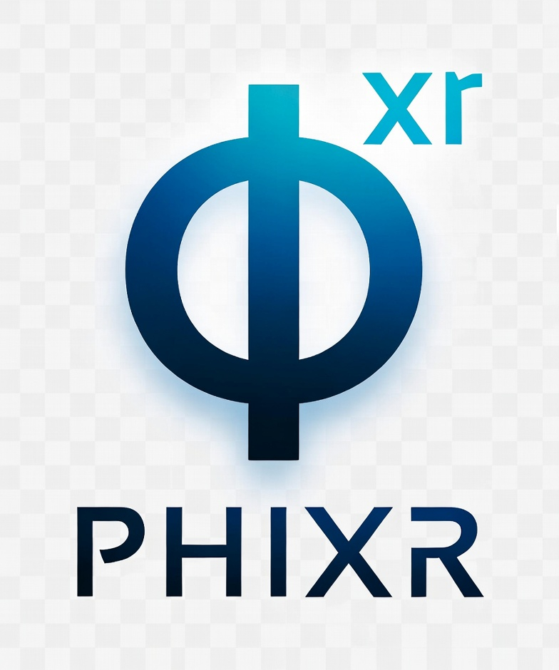

<div align="center">
  
  <h1>Phixr</h1>
  <p>Seamless GitLab-AI Integration Platform</p>
</div>

---

Phixr bridges GitLab's issue workflow with AI coding agents. It runs as a lightweight FastAPI service that listens for GitLab webhooks, routes `@phixr` mentions to OpenCode AI sessions, and posts results back to the issue. No context switching, no separate tools -- just comment on an issue and let the AI work.

## How It Works

```
Developer:  @phixr /session
Phixr:      Session started on branch ai-work/issue-42.

Developer:  @phixr Add input validation to the user registration endpoint
Phixr:      Working on it...
Phixr:      Done. Added validation for email, password length, and username format.
             See branch ai-work/issue-42 (3 commits).

Developer:  @phixr /end
Phixr:      Session closed.
```

## Features

- **Persistent sessions** -- one OpenCode session per GitLab issue, maintained across comments
- **Independent mode** -- AI works autonomously, posts results back to the issue
- **Vibe mode** -- `@phixr /session --vibe` returns a live OpenCode UI link for interactive collaboration
- **Automatic Git workflow** -- branch creation, commits, and merge requests handled for you
- **Multi-provider AI** -- Ollama (default), Zen, OpenAI, or any OpenAI-compatible provider
- **Redis state management** -- scalable session tracking for multi-user deployments

## Quick Start

```bash
git clone https://github.com/jtwolfe/phixr.git && cd phixr
python3 -m venv venv && source venv/bin/activate
pip install -r requirements.txt
cp .env.example .env.local   # edit with your GitLab URL, tokens, etc.
python -m phixr.main
```

For full setup instructions including GitLab webhook configuration, see the [documentation](https://jtwolfe.github.io/phixr/).

## AI Providers

Phixr works with any OpenAI-compatible provider. Configure via environment variables:

```bash
# Ollama (default, local)
PHIXR_SANDBOX_PROVIDER=ollama
PHIXR_SANDBOX_MODEL=qwen2.5-coder
PHIXR_SANDBOX_PROVIDER_BASE_URL=http://localhost:11434

# Zen
PHIXR_SANDBOX_PROVIDER=zen
PHIXR_SANDBOX_MODEL=big-pickle
PHIXR_SANDBOX_PROVIDER_API_KEY=your-zen-key

# OpenAI
PHIXR_SANDBOX_PROVIDER=openai
PHIXR_SANDBOX_MODEL=gpt-4o
PHIXR_SANDBOX_PROVIDER_API_KEY=your-openai-key
PHIXR_SANDBOX_PROVIDER_BASE_URL=https://api.openai.com/v1
```

## Roadmap

- **LiteLLM inference** -- unified multi-provider routing with cost tracking and rate limiting
- **GitLab JWT auth** -- user identity, project-level permissions, and audit trails
- **Gitea support** -- extend beyond GitLab to Gitea-hosted repositories
- **Session history** -- PostgreSQL-backed logs for review and replay
- **MR workflows** -- AI-assisted code review on merge request comments

See the full [Roadmap](https://jtwolfe.github.io/phixr/roadmap) for details.

## Documentation

Full documentation at [jtwolfe.github.io/phixr](https://jtwolfe.github.io/phixr/)

## License

MIT
